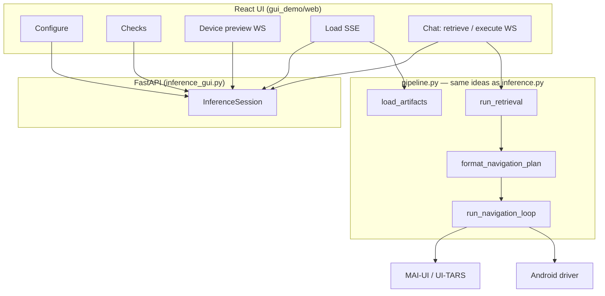
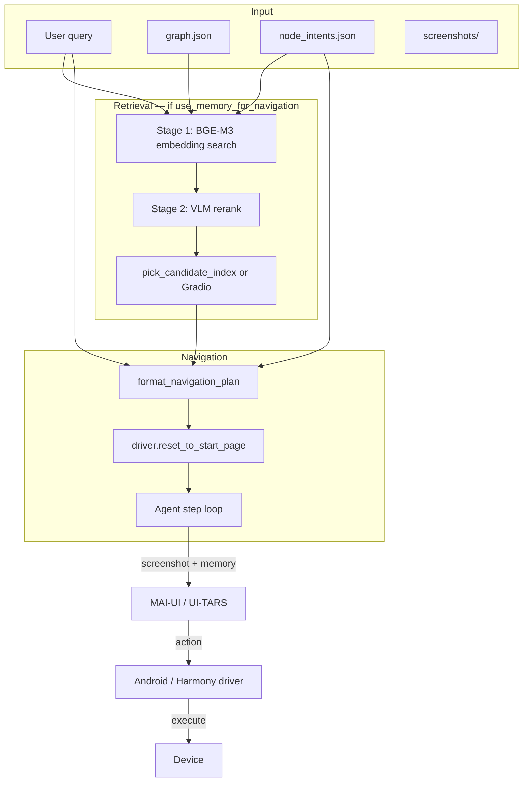

# Inference

Run a natural-language navigation goal on a **physical device** using an explored app graph. Inference retrieves the best target screen from exploration artifacts, optionally lets you confirm the pick in a Gradio UI, then drives the UI agent step-by-step until the goal is reached.

**Prerequisites:** Complete [exploration](../exploration/README.md) and **post-processing** for the same app so `logs.root` contains `graph.json`, `node_intents.json`, `node_navigation_plans.json`, and `screenshots/`.

**Recommended for demos:** use the [Inference GUI](#inference-gui-demo-wizard) (`run_gui.sh`) — a browser wizard that walks through config, device checks, retrieval, and on-device navigation. For scripted or batch runs, use the [CLI](#quick-start-cli) (`inference.py`).

---

## Inference GUI (demo wizard)

A **React + FastAPI** web UI for live demos: pick an app config, verify agent and device, preview the phone, then run the full **retrieval → candidate pick → navigation** loop from a chat panel.

The GUI reuses the same retrieval and navigation logic as [`inference.py`](inference.py), factored into [`gui_demo/pipeline.py`](gui_demo/pipeline.py). The CLI script does not depend on `gui_demo/`.

### Layout

```text
inference/
├── run_gui.sh              # Recommended launcher (build frontend + start server)
└── gui_demo/
    ├── inference_gui.py    # FastAPI backend (REST + WebSockets + static UI)
    ├── pipeline.py         # load_artifacts, run_retrieval, run_navigation_loop
    ├── requirements-gui.txt
    └── web/                # React + Vite frontend
        ├── src/            # Source (committed)
        └── dist/           # Production build (gitignored; built by run_gui.sh)
```

### What you need before running

| Requirement | Notes |
|-------------|--------|
| **Exploration artifacts** | Under `logs.root` in your config: `graph.json`, `node_intents.json`, `node_navigation_plans.json`, `screenshots/{node_id}.jpg` |
| **Python env** | Same env as CLI inference (FlagEmbedding, dynaconf, dashscope, OpenCV, etc.) |
| **GUI extras** | `pip install -r gui_demo/requirements-gui.txt` (FastAPI, uvicorn, PyYAML) |
| **Node.js 18+** | For `npm install` / `npm run build` in `gui_demo/web/` |
| **ADB device** | Emulator or physical device visible in `adb devices` |
| **Agent server** | MAI-UI or UI-TARS at the `agent.url` in config (default port `8089`) |

Pick or edit a config under `inference/configs/` (e.g. `outlook_android.yaml`). Set `driver.device_id`, `logs.root` (path to explored app output), and API keys before the demo.

### One-time setup

From the `inference/` directory with your Python env active:

```bash
cd inference

# GUI Python packages
pip install -r gui_demo/requirements-gui.txt

# Frontend dependencies (unset proxy if npm hangs)
unset HTTP_PROXY HTTPS_PROXY http_proxy https_proxy ALL_PROXY all_proxy
cd gui_demo/web && npm install && cd ../..
```

You only need `npm install` once (or after `package.json` changes). **`run_gui.sh` runs `npm run build` automatically** on every start so `web/dist/` is up to date.

### Run (recommended)

```bash
cd inference
bash run_gui.sh
```

Then open **[http://localhost:8765](http://localhost:8765)**.

`run_gui.sh`:

1. `cd`s to `inference/` (so imports resolve).
2. Unsets common proxy env vars (avoids npm/curl issues).
3. Runs `npm run build` in `gui_demo/web/`.
4. Starts `uvicorn gui_demo.inference_gui:app --host 0.0.0.0 --port 8765`.

### Run (manual / development)

**Production (single port)** — serve built React from `web/dist/`:

```bash
cd inference
cd gui_demo/web && npm run build && cd ../..
unset HTTP_PROXY HTTPS_PROXY http_proxy https_proxy ALL_PROXY all_proxy
uvicorn gui_demo.inference_gui:app --host 0.0.0.0 --port 8765
```

**Development (hot-reload frontend, two terminals):**

```bash
# Terminal 1 — API
cd inference
uvicorn gui_demo.inference_gui:app --reload --port 8765

# Terminal 2 — Vite (proxies /api and /ws to :8765)
cd inference/gui_demo/web
npm run dev
```

Open [http://localhost:5173](http://localhost:5173) for dev, or [http://localhost:8765](http://localhost:8765) after a production build.

### Wizard: what to do (5 steps)

Complete each step in order; later steps stay locked until the previous one succeeds.

| Step | UI action | What happens on the backend |
|------|-----------|---------------------------|
| **1. Configure** | Pick a config from the dropdown (all `configs/*.yaml`), edit fields if needed, click **Apply Config** | `POST /api/config/select` or `PUT /api/config` loads YAML into server session; relative `logs.root` is resolved from `inference/` |
| **2. Checks** | Click **Run Checks** | `POST /api/checks/run` — curls agent `GET /v1/models`; runs `driver.check_device()` and reports foreground package |
| **3. Device** | Click **Connect to Device** | `POST /api/device/connect` — builds driver, launches app; `WS /ws/device` streams live JPEG screenshots (~1.5s interval) |
| **4. Load** | Click **Load Resources** | `GET /api/resources/load/stream` (SSE) loads graph, intents, navigation plans, BGE-M3, VLM, and agent |
| **5. Navigate** | Chat panel: prompt → pick candidate → **Execute** | `POST /api/retrieve` → `POST /api/select-node` → `WS /ws/execution` streams agent steps |

**Typical demo flow**

1. Start `bash run_gui.sh` and open the browser.
2. **Configure** — select e.g. `outlook_android`, confirm `logs.root` points to your explored app folder, **Apply**.
3. **Checks** — ensure agent and device both pass (fix `device_id` / agent URL if not).
4. **Device** — connect; confirm live preview shows the app.
5. **Load** — wait for all progress items (first BGE-M3 load can take ~30s).
6. **Navigate** — type a goal (e.g. *Navigate to the Feedback to Microsoft page.*), **Send**.
7. If `use_memory_for_navigation` is on: review **candidate cards** (exploration screenshots + scores), tap the best match.
8. Read the **navigation memory** message, then click **Execute**.
9. Watch **step stream** (thought + annotated screenshot per action). Use **Stop Navigation** to halt after the current step.
10. Send another prompt to run again without reloading resources.

If `use_memory_for_navigation` is **off**, steps 7–8 are skipped: **Execute** is offered right after the prompt and the agent relies on the screenshot + goal only.

On wide screens, a live device preview panel sits beside the chat during execution.

### How it works (logic)



**Session state** — one in-memory `InferenceSession` holds config, driver, agent, loaded artifacts (`RetrievalContext`), retrieval candidates, selected `node_id`, and execution flags. Changing config clears runtime state.

**Load resources** (`load_artifacts` in `pipeline.py`):

1. `graph.json` → NetworkX graph + per-node **depth** (shortest hop from nearest root).
2. `node_intents.json` → `user_intents`, `embedding` vectors, `enhanced_page_summary`.
3. `node_navigation_plans.json` → per-node `ui_navigation_memory` (clustered route plans from post-process Stage 2).
4. BGE-M3 model loaded for query encoding at retrieval time.
5. `VLM` client for stage-2 reranking.
6. Agent client connected to `agent.url`.

**Retrieve** (when `use_memory_for_navigation: true`):

1. **Stage 1** — encode the user query with BGE-M3; cosine-search against precomputed node embeddings; keep top `top_k_in_first_stage_retrieval`.
2. **Stage 2** — `VLM.rerank_candidates` with `page_purpose`, depth, scores, and `user_intents`; keep top `top_k_retrieval_in_stage_2`.
3. Return candidate cards with exploration screenshots (`GET /api/screenshots/{node_id}`).

**Navigation memory** — for the selected node, `get_ui_navigation_memory_for_node` reads plans from `node_navigation_plans.json`, then `format_navigation_plan` builds the text prompt (waypoints + transition hints) passed to the agent.

**Execute** (`run_navigation_loop`):

1. `driver.reset_to_start_page()` (back, relaunch, optional `reset_instruction`).
2. Loop up to `agent.max_steps`: screenshot → `agent.step(navigation_memory, screenshot)` → execute action until `finish` or stop.
3. Steps stream over `WS /ws/execution` as JSON (thought, coordinates, annotated screenshot). Stop is cooperative (finishes current step, then halts).

This mirrors CLI `inference.py` except candidate selection is **interactive** (tap a card) instead of `pick_candidate_index` or Gradio.

### API surface (reference)

| Endpoint | Purpose |
|----------|---------|
| `GET /api/configs` | List available YAML configs |
| `POST /api/config/select` | Load config by id (e.g. `outlook_android`) |
| `PUT /api/config` | Apply edited config JSON |
| `POST /api/checks/run` | Agent + device health |
| `POST /api/device/connect` | Launch app on device |
| `WS /ws/device` | Live device screenshot stream |
| `GET /api/resources/load/stream` | SSE progress while loading artifacts |
| `POST /api/retrieve` | Run embedding + VLM retrieval for a query |
| `POST /api/select-node` | Set selected target `node_id` |
| `POST /api/navigation-memory` | Preview formatted navigation prompt |
| `POST /api/execute/start` | Arm execution (then open execution WebSocket) |
| `POST /api/execute/stop` | Request cooperative stop |
| `WS /ws/execution` | Stream navigation steps |

### GUI troubleshooting

| Issue | Fix |
|-------|-----|
| `ModuleNotFoundError: No module named 'gui_demo'` | Run from `inference/`, not repo root. Use `bash run_gui.sh`. |
| `npm run build` fails or hangs | Unset proxy env vars; run `npm install` in `gui_demo/web/` first. |
| Blank page at `:8765` | Build failed or `web/dist/` missing — check `run_gui.sh` output. |
| Agent check fails | Confirm `agent.url`; test `curl -sSf http://HOST:8089/v1/models`. |
| Device check fails | Run `adb devices`; set `driver.device_id` in config. |
| Load fails on graph/intents | Verify `logs.root` and that exploration + post-process completed. |
| Load fails on navigation plans | Ensure `node_navigation_plans.json` exists under `logs.root`. |
| No candidate cards | Set `use_memory_for_navigation: true`; ensure `embedding` fields exist in `node_intents.json`. |
| Stop does not interrupt instantly | Stop is cooperative — finishes the current agent step, then halts. |

---

## Quick start (CLI)

For interactive demos, prefer the [GUI](#inference-gui-demo-wizard) (`bash run_gui.sh`). Use the CLI for scripted runs, batch evaluation, or Gradio candidate picking (`pick_candidate_index: -1`).

From the `inference/` directory:

```bash
cd inference
python inference.py --config configs/clock_android.yaml
```

If `query` is empty in the config, the script prompts:

```text
Enter your query:
```

### What happens at runtime

1. Load the explored graph and node intents from `logs.root`.
2. If `use_memory_for_navigation` is `true`, run two-stage retrieval, then select a target node (automatically via `pick_candidate_index`, or interactively via Gradio when `pick_candidate_index: -1`).
3. Format navigation memory (or an empty instruction) for the agent.
4. Reset the device to a known start screen (`driver.reset_to_start_page()`).
5. Loop: agent observes screenshot → proposes action → driver executes until `finish` or `agent.max_steps`.
6. Optionally save screenshots, annotated screenshots, `actions.json`, and `prompt.json` under `output_dir`.

---

## YAML config files

Configs live in `inference/configs/`. Each file has a top-level `default:` block loaded by [Dynaconf](https://www.dynaconf.com/).

| Config | App | Platform |
|--------|-----|----------|
| `airbnb_android.yaml` | Airbnb | Android |
| `amazon_android.yaml` | Amazon | Android |
| `clock_android.yaml` | Clock | Android |
| `ebay_android.yaml` | eBay | Android |
| `google_maps_android.yaml` | Google Maps | Android |
| `linkedin_android.yaml` | LinkedIn | Android |
| `outlook_android.yaml` | Outlook | Android (includes batch-mode example) |
| `target_android.yaml` | Target | Android |
| `yelp_android.yaml` | Yelp | Android |
| `youtube_android.yaml` | YouTube | Android |

Copy an existing config and adjust `device_id`, API keys, `logs.root`, and paths for your setup.

### `app`

Metadata about the target application (used by drivers/agents where needed).

| Field | Description |
|-------|-------------|
| `name` | Human-readable app name |
| `description` | Short description of what the app does |

### `driver`

Controls the device connection and app launch. Built by `Driver.factory.build_driver`.

| Field | Description |
|-------|-------------|
| `device_id` | ADB / device identifier |
| `os_name` | `"android"` or `"harmony"` |
| `appPackage` | App package name |
| `appActivity` | Launch activity |
| `skip_exploration_for_no_app_package` | *(optional)* Skip work when the foreground app is not the target package |
| `reset_instruction` | *(optional)* Natural-language instruction the agent runs after relaunch to reach a consistent tab/screen (e.g. *"Go Alarm tab..."*). If omitted, reset stops after relaunch + scroll. |
| `use_launcher_intent` | *(optional, Android)* Launch via launcher intent |

### `vlm`

API settings for the VLM used in **stage-2 reranking** (`VLM.rerank_candidates`).

| Field | Description |
|-------|-------------|
| `alibaba_api_key` | DashScope / Alibaba API key |
| `yibu_api_key` | Yibu API key (when `use_yibu_api` is true) |
| `use_yibu_api` | Route VLM calls through Yibu instead of Alibaba |

### `agent`

The on-device navigation model (MAI-UI or UI-TARS). Built by `Agents.factory.build_agent`.

| Field | Description |
|-------|-------------|
| `url` | OpenAI-compatible API base URL for the agent server |
| `model_name` | `"mai_ui"` or `"ui_tars"` |
| `verbose_print` | Log agent internals |
| `settings.history_n` | Number of past steps kept in agent memory |
| `settings.resize_factor` | Screenshot resize factor sent to the agent |
| `max_steps` | Maximum on-device navigation steps per task (default: 10) |

#### MAI-UI server (vLLM)

When `model_name` is `mai_ui`, serve **HuggingFace** [`Tongyi-MAI/MAI-UI-8B`](https://huggingface.co/Tongyi-MAI/MAI-UI-8B) behind an OpenAI-compatible endpoint.

**vLLM version:** use **vLLM &lt; 0.2** (the official MAI-UI stack pins **`vllm==0.11.0`**). **vLLM 0.21+** has been observed to return plausible reasoning but **wrong grounding coordinates** (taps land on the wrong UI element). Pin compatible deps on the server, e.g. `transformers==4.57.6` (&lt; 5.0), `tokenizers` 0.22.x, `numpy≤2.2`.

**Smoke test (strongly encouraged):** before a full `inference.py` run, verify grounding on a single device screenshot:

```python
from dynaconf import Dynaconf
from Agents.factory import build_agent
from Driver.factory import build_driver

configs = Dynaconf(settings_files=["configs/amazon_android.yaml"]).default
agent = build_agent(
    model_name=configs.agent.model_name,
    url=configs.agent.url,
    agent_settings=configs.agent.settings,
)
driver = build_driver(settings=configs.driver, agent=agent)

screenshot = driver.take_screenshot()
(parsed, sent_w, sent_h), meta = agent.grounding_action(
    "click on the Haul chip button",  # pick a visible, unambiguous target on this screen
    screenshot,
)
print(parsed.thought, parsed.orig_coords)

# Optional: tap on device and confirm the UI responds as expected
driver.execute_action(parsed)
```

If coordinates look wrong (e.g. Y lands on a different row than the described element), fix the agent server stack (vLLM version and pins above) before relying on navigation.

### `logs`

| Field | Description |
|-------|-------------|
| `root` | Path to exploration output (relative to `inference/` or absolute). Must contain `graph.json`, `node_intents.json`, `node_navigation_plans.json`, and `screenshots/{node_id}.jpg`. |
| `resume_from_checkpoint` | Used by exploration; ignored by inference |

### Inference-specific fields

| Field | Default | Description |
|-------|---------|-------------|
| `query` | — | User goal in natural language (single-task mode). If empty and `batch_mode` is `false`, the script prompts interactively. Ignored when `batch_mode` is `true`. |
| `use_memory_for_navigation` | — | **`true`**: run embedding + VLM retrieval, then pick a target node. **`false`**: skip retrieval; agent navigates from the screenshot only (empty navigation memory). |
| `top_k_in_first_stage_retrieval` | — | Number of nodes returned by embedding search (stage 1). Typical: 15–30. |
| `top_k_retrieval_in_stage_2` | — | Number of nodes kept after VLM rerank (stage 2). These are the candidates you can choose from via `pick_candidate_index` or Gradio. Typical: 3–5. |
| `pick_candidate_index` | `-1` | Which stage-2 candidate to navigate with. See [pick_candidate_index](#pick_candidate_index) below. |
| `batch_mode` | `false` | **`true`**: run every task under `input_dir` instead of a single `query`. Requires `input_dir` and `output_dir`. |
| `input_dir` | — | Root directory of a benchmark dataset. Each immediate subdirectory must contain a `prompts.json` with a `prompts` list; the **first** prompt is used as the task goal. |
| `output_dir` | — | Where to write run artifacts (screenshots, `actions.json`, `prompt.json`). Required in batch mode; optional in single-task mode. |

#### `pick_candidate_index`

After stage-2 VLM reranking, candidates are ordered best-first (index `0` = top VLM pick, `1` = second best, and so on). This field chooses which candidate’s `ui_navigation_memory` drives on-device navigation.

| Value | Behavior |
|-------|----------|
| `0` | Use the best VLM-ranked candidate (most common for automated runs). |
| `1`, `2`, … | Use the 2nd, 3rd, … best candidate. Must be **&lt; `top_k_retrieval_in_stage_2`**. |
| `-1` | Open the Gradio picker (`pick_candidate`) so you can confirm the target page manually. |

**When to change it:** If the top-ranked page is wrong but a lower-ranked candidate looks correct in exploration screenshots, retry with `pick_candidate_index: 1` (or higher) without re-running retrieval.

**Batch evaluation tip:** To save trajectories for all stage-2 candidates, run batch mode once per index (`0` … `top_k_retrieval_in_stage_2 - 1`). Each run writes to a separate folder (see [Batch mode](#batch-mode)).

### Example (minimal)

```yaml
default:
  app:
    name: "Clock"
    description: "Alarms, timers, stopwatch, and world clocks."

  driver:
    device_id: "YOUR_DEVICE_ID"
    os_name: "android"
    appPackage: "com.google.android.deskclock"
    appActivity: "com.android.deskclock.DeskClock"
    reset_instruction: "Go Alarm tab. (if Alarm tab is highlighted return Finish)"

  vlm:
    alibaba_api_key: "YOUR_KEY"
    yibu_api_key: "YOUR_KEY"
    use_yibu_api: true

  agent:
    url: "http://YOUR_AGENT_HOST:8089/v1"
    model_name: "mai_ui"
    settings:
      history_n: 3
      resize_factor: 0.75

  logs:
    root: "../exploration/explored_apps/clock"

  use_memory_for_navigation: true
  query: "Navigate to the Timer section."
  top_k_in_first_stage_retrieval: 15
  top_k_retrieval_in_stage_2: 5
  pick_candidate_index: 0

  # Optional: batch evaluation over a dataset
  # batch_mode: true
  # input_dir: "/path/to/dataset/"
  # output_dir: "./results"
```

### Example (batch mode)

```yaml
default:
  # ... app, driver, vlm, agent, logs as above ...

  batch_mode: true
  input_dir: "/path/to/AgentNavigatorDataset/DATA/outlook_5.2604.1/"
  output_dir: "./results"

  use_memory_for_navigation: true
  top_k_in_first_stage_retrieval: 30
  top_k_retrieval_in_stage_2: 5
  pick_candidate_index: 0   # run again with 1, 2, ... to save all top-k trajectories
```

---

## Batch mode

When `batch_mode: true`, inference iterates over every task subdirectory under `input_dir`, reads the first prompt from each `prompts.json`, and runs the full retrieval + navigation pipeline for that goal.

### Input layout

```text
input_dir/
  run_001_outlook/
    prompts.json          # { "prompts": ["Navigate to ..."] }
  run_002_outlook/
    prompts.json
  ...
```

### Output layout

Each run is saved under `{output_dir}/{task_name}_{pick_candidate_index}/`:

```text
results/
  run_001_outlook_0/
    0.jpg                 # raw screenshots (one per step)
    1.jpg
    ...
    annotated_screenshots/
      0.jpg               # same frames with click/swipe overlays
      ...
    actions.json          # [{ "type", "coordinate", "thought" }, ...]
    prompt.json           # { "query": "..." }
  run_001_outlook_1/      # same task, 2nd-best stage-2 candidate
  run_002_outlook_0/
  ...
```

The `{pick_candidate_index}` suffix records which stage-2 rerank slot was used for that trajectory.

### Saving all top-k stage-2 trajectories

Stage 2 returns up to `top_k_retrieval_in_stage_2` ranked target pages. A single batch run navigates with **one** of them (controlled by `pick_candidate_index`). To benchmark or compare every reranked candidate:

1. Set `batch_mode: true`, `input_dir`, and `output_dir`.
2. Run inference with `pick_candidate_index: 0`, then `1`, … up to `top_k_retrieval_in_stage_2 - 1`.
3. Each run produces a full trajectory per task under `{task_name}_{index}/`.

This lets you compare whether the 1st, 2nd, or 3rd VLM pick actually reaches the goal on device, without re-running stage-1 embedding search.

---

## Retrieval and navigation hierarchy

Inference splits **finding the right screen** (retrieval) from **getting there on the device** (navigation).



### Stage 1 — Embedding retrieval

**Function:** `retrieve_nodes_from_user_intents_embeddings`

- Loads precomputed `embedding` vectors from `node_intents.json` (written during exploration post-process).
- Encodes the user query with **BGE-M3** (`BAAI/bge-m3`).
- Scores all nodes by cosine similarity and returns the top `top_k_in_first_stage_retrieval` hits.
- Each candidate is enriched with `page_purpose` (from `graph.json`), `depth`, `user_intents`, and `ui_navigation_memory`.

The query text is wrapped by `build_retrieval_query()` so embeddings align with how nodes were indexed (`PAGE_PURPOSE` + `USER_INTENTS`).

### Node depth

**Function:** `get_node_depths`

Each graph node gets a **depth**: the shortest path length from the nearest root node (`is_root: true` in `graph.json`). Depth 0 is a root/home screen; higher values are deeper in the UI hierarchy.

Depth is **not** used in stage-1 embedding search. It is attached to each candidate and passed to the VLM in stage 2 as an explicit decision signal, alongside `page_purpose`, embedding `score`, and `user_intents`.

**Why depth matters:** Broad user queries (e.g. *"go to settings"*) should usually land on a **shallower**, more general parent page—not a deep sub-settings screen that only partially matches. Specific queries (e.g. *"change world clock style"*) should prefer the **deepest** page that directly satisfies the goal. The VLM prompt encodes this: match query specificity first, then use depth as a tie-breaker when relevance is similar (lower depth = easier to reach from the app root).

### Stage 2 — VLM rerank

**Function:** `VLM.rerank_candidates`

- Sends the shortlist to a multimodal LLM with ranking rules: prefer direct `page_purpose` match, align with query breadth vs. specificity, then break ties with depth.
- Returns `top_k_node_ids` (ordered best-first) and per-node `reasoning`.
- Keeps the top `top_k_retrieval_in_stage_2` candidates for selection via `pick_candidate_index` or Gradio.

### Candidate selection — `pick_candidate_index` or Gradio

**Automatic (`pick_candidate_index` ≥ 0):** Uses the candidate at that index in the stage-2 list (no UI).

**Interactive (`pick_candidate_index: -1`):** **Function:** `pick_candidate`

- Opens a local Gradio UI at `http://127.0.0.1:7860`.
- Shows screenshots and metadata (score, depth, page purpose, VLM reasoning).
- User selects a candidate and clicks **Confirm and continue**; the script resumes with that `node_id`.

Requires `pip install gradio`.

### Navigation memory formatting

**Function:** `format_navigation_plan`

- Takes `ui_navigation_memory` for the selected node (list of plans: waypoint sequences, transition hints, optional `root_id`).
- Produces a structured prompt telling the agent to pick the plan that matches the **current screenshot**, follow waypoints, and **finish immediately** when the goal screen is already visible.

If `use_memory_for_navigation` is `false`, this step receives an empty list and the agent gets a short instruction to rely on the screenshot and goal only.

### On-device navigation loop

After `driver.reset_to_start_page()` (back ×5, close app, relaunch, optional `reset_instruction`):

```text
for up to agent.max_steps:
    screenshot = driver.take_screenshot()
    action = agent.step(navigation_memory, screenshot)
    if action is finish → stop
    else driver.execute_action(action)
```

The agent (`mai_ui` or `ui_tars`) is a separate server; inference only sends screenshots and the formatted memory string.

---

## Required artifacts under `logs.root`

| File / folder | Source | Used for |
|---------------|--------|----------|
| `graph.json` | Exploration export | Node `page_purpose`, graph structure, depths |
| `node_intents.json` | Post-process Stage 1 + 3 | Embeddings, `user_intents`, `enhanced_page_summary` |
| `node_navigation_plans.json` | Post-process Stage 2 | `ui_navigation_memory` per node |
| `screenshots/{node_id}.jpg` | Exploration | Gradio / GUI candidate cards, debugging |

If any of these are missing, retrieval or the picker may fail or show empty galleries.

---

## Dependencies

Run from `inference/` with the same Python environment as exploration. Key packages used by `inference.py`:

- `dynaconf` — config loading
- `FlagEmbedding` — BGE-M3 (stage 1)
- `gradio` — candidate picker
- `networkx` — graph depths
- `dashscope` — VLM rerank (via `VLM.py`)

Device control and agents are provided under `Driver/` and `Agents/` in this directory.

**GUI (`gui_demo/`)** additionally requires packages in [`gui_demo/requirements-gui.txt`](gui_demo/requirements-gui.txt) (`fastapi`, `uvicorn`, `pyyaml`) and a Node.js build of `gui_demo/web/`. See [Inference GUI](#inference-gui-demo-wizard).

---

## Troubleshooting

| Issue | Check |
|-------|--------|
| `No root node found with is_root=True` | `graph.json` must mark at least one node with `is_root: true` |
| Gradio opens but no images | `screenshots/{node_id}.jpg` paths under `logs.root` |
| Agent does nothing / wrong screen | `reset_instruction`, `appPackage` / `appActivity`, agent `url` reachable |
| Agent reasoning OK but taps miss UI | MAI-UI server likely on **vLLM ≥ 0.2** (e.g. 0.21.x) — use **vllm==0.11.0**; run the [grounding smoke test](#mai-ui-server-vllm) |
| Retrieval picks wrong page | Increase `top_k_in_first_stage_retrieval`, try a different `pick_candidate_index`, or use Gradio (`-1`) |
| Wrong page but 2nd candidate looks right | Re-run with `pick_candidate_index: 1` (or higher) |
| Batch mode: `input_dir is required` | Set `input_dir` to the dataset root |
| Batch mode: empty output | Set `output_dir`; check task folders contain `prompts.json` |
| Skip retrieval entirely | Set `use_memory_for_navigation: false` |

---

## Related docs

- [Exploration README](../exploration/README.md) — how `graph.json`, `node_intents.json`, and `node_navigation_plans.json` are produced
- GUI launcher: [`run_gui.sh`](run_gui.sh) · backend: [`gui_demo/inference_gui.py`](gui_demo/inference_gui.py) · pipeline: [`gui_demo/pipeline.py`](gui_demo/pipeline.py)
- Config templates: `inference/configs/*.yaml`
