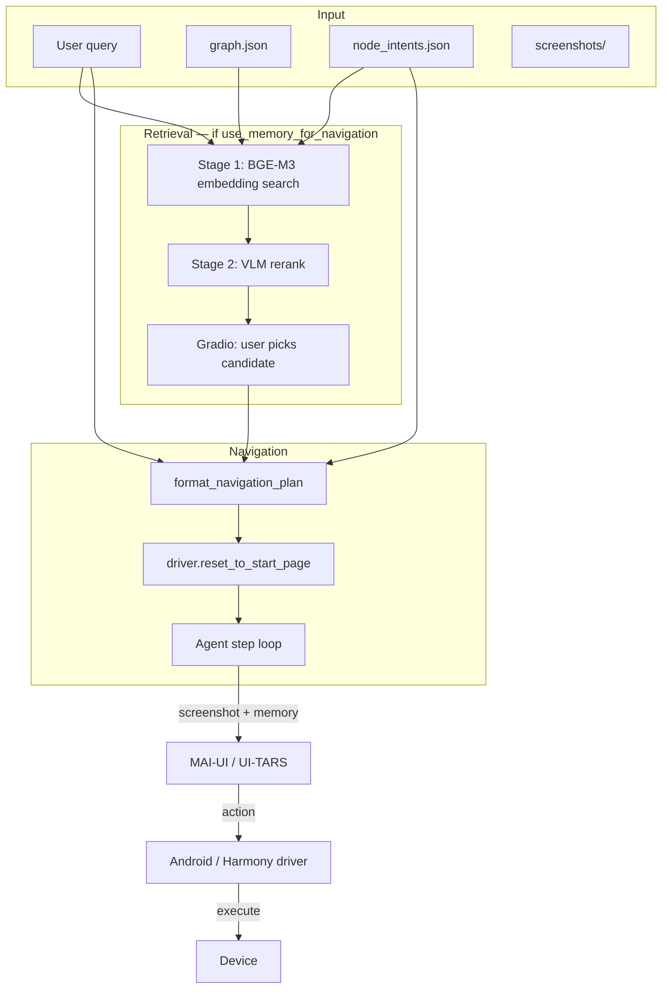

# Inference

Run a natural-language navigation goal on a **physical device** using an explored app graph. Inference retrieves the best target screen from exploration artifacts, optionally lets you confirm the pick in a Gradio UI, then drives the UI agent step-by-step until the goal is reached.

**Prerequisites:** Complete [exploration](../exploration/README.md) and **post-processing** for the same app so `logs.root` contains `graph.json`, `node_intents.json`, and `screenshots/`.

---

## Quick start

From the `inference/` directory:

```bash
cd inference
python inference.py --config configs/clock_harmony.yaml
```

If `query` is empty in the config, the script prompts:

```text
Enter your query:
```

### What happens at runtime

1. Load the explored graph and node intents from `logs.root`.
2. If `use_memory_for_navigation` is `true`, run two-stage retrieval and open a Gradio picker.
3. Format navigation memory (or an empty instruction) for the agent.
4. Reset the device to a known start screen (`driver.reset_to_start_page()`).
5. Loop: agent observes screenshot → proposes action → driver executes until `finish` or 10 steps.

---

## YAML config files

Configs live in `inference/configs/`. Each file has a top-level `default:` block loaded by [Dynaconf](https://www.dynaconf.com/).

| Config | App | Platform |
|--------|-----|----------|
| `clock_harmony.yaml` | Clock | HarmonyOS |
| `clock_android.yaml` | Clock | Android |
| `amazon_android.yaml` | Amazon | Android |
| `youtube_android.yaml` | YouTube | Android (template; align `logs.root` with your exploration output) |

Copy an existing config and adjust device IDs, API keys, and paths for your setup.

### `app`

Metadata about the target application (used by drivers/agents where needed).

| Field | Description |
|-------|-------------|
| `name` | Human-readable app name |
| `description` | Short description of what the app does |

### `driver`

Controls the device connection and app launch. Built by `Driver.factory.build_driver`.

| Field | Description |
|-------|-------------|
| `device_id` | ADB / device identifier |
| `os_name` | `"android"` or `"harmony"` |
| `appPackage` | App package name |
| `appActivity` | Launch activity |
| `skip_exploration_for_no_app_package` | *(optional)* Skip work when the foreground app is not the target package |
| `reset_instruction` | *(optional)* Natural-language instruction the agent runs after relaunch to reach a consistent tab/screen (e.g. *"Go Alarm tab..."*). If omitted, reset stops after relaunch + scroll. |
| `use_launcher_intent` | *(optional, Android)* Launch via launcher intent |

### `vlm`

API settings for the VLM used in **stage-2 reranking** (`VLM.rerank_candidates`).

| Field | Description |
|-------|-------------|
| `alibaba_api_key` | DashScope / Alibaba API key |
| `yibu_api_key` | Yibu API key (when `use_yibu_api` is true) |
| `use_yibu_api` | Route VLM calls through Yibu instead of Alibaba |

### `agent`

The on-device navigation model (MAI-UI or UI-TARS). Built by `Agents.factory.build_agent`.

| Field | Description |
|-------|-------------|
| `url` | OpenAI-compatible API base URL for the agent server |
| `model_name` | `"mai_ui"` or `"ui_tars"` |
| `verbose_print` | Log agent internals |
| `settings.history_n` | Number of past steps kept in agent memory |
| `settings.resize_factor` | Screenshot resize factor sent to the agent |

#### MAI-UI server (vLLM)

When `model_name` is `mai_ui`, serve **HuggingFace** [`Tongyi-MAI/MAI-UI-8B`](https://huggingface.co/Tongyi-MAI/MAI-UI-8B) behind an OpenAI-compatible endpoint.

**vLLM version:** use **vLLM &lt; 0.2** (the official MAI-UI stack pins **`vllm==0.11.0`**). **vLLM 0.21+** has been observed to return plausible reasoning but **wrong grounding coordinates** (taps land on the wrong UI element). Pin compatible deps on the server, e.g. `transformers==4.57.6` (&lt; 5.0), `tokenizers` 0.22.x, `numpy≤2.2`.

**Smoke test (strongly encouraged):** before a full `inference.py` run, verify grounding on a single device screenshot:

```python
from dynaconf import Dynaconf
from Agents.factory import build_agent
from Driver.factory import build_driver

configs = Dynaconf(settings_files=["configs/amazon_android.yaml"]).default
agent = build_agent(
    model_name=configs.agent.model_name,
    url=configs.agent.url,
    agent_settings=configs.agent.settings,
)
driver = build_driver(settings=configs.driver, agent=agent)

screenshot = driver.take_screenshot()
(parsed, sent_w, sent_h), meta = agent.grounding_action(
    "click on the Haul chip button",  # pick a visible, unambiguous target on this screen
    screenshot,
)
print(parsed.thought, parsed.orig_coords)

# Optional: tap on device and confirm the UI responds as expected
driver.execute_action(parsed)
```

If coordinates look wrong (e.g. Y lands on a different row than the described element), fix the agent server stack (vLLM version and pins above) before relying on navigation.

### `logs`

| Field | Description |
|-------|-------------|
| `root` | Path to exploration output (relative to `inference/` or absolute). Must contain `graph.json`, `node_intents.json`, and `screenshots/{node_id}.jpg`. |
| `resume_from_checkpoint` | Used by exploration; ignored by inference |

### Inference-specific fields

| Field | Default | Description |
|-------|---------|-------------|
| `query` | — | User goal in natural language. If set, skips the interactive prompt. |
| `use_memory_for_navigation` | — | **`true`**: run embedding + VLM retrieval and show the Gradio candidate picker. **`false`**: skip retrieval; agent navigates from the screenshot only (empty navigation memory). |
| `top_k_in_first_stage_retrieval` | — | Number of nodes returned by embedding search (stage 1). Typical: 15–30. |
| `top_k_retrieval_in_stage_2` | — | Number of nodes kept after VLM rerank (stage 2) and shown in the picker. Typical: 3–5. |

### Example (minimal)

```yaml
default:
  app:
    name: "Clock"
    description: "Alarms, timers, stopwatch, and world clocks."

  driver:
    device_id: "YOUR_DEVICE_ID"
    os_name: "android"
    appPackage: "com.google.android.deskclock"
    appActivity: "com.android.deskclock.DeskClock"
    reset_instruction: "Go Alarm tab. (if Alarm tab is highlighted return Finish)"

  vlm:
    alibaba_api_key: "YOUR_KEY"
    yibu_api_key: "YOUR_KEY"
    use_yibu_api: true

  agent:
    url: "http://YOUR_AGENT_HOST:8089/v1"
    model_name: "mai_ui"
    settings:
      history_n: 3
      resize_factor: 0.75

  logs:
    root: "../exploration/explored_apps/clock"

  use_memory_for_navigation: true
  query: "Navigate to the Timer section."
  top_k_in_first_stage_retrieval: 15
  top_k_retrieval_in_stage_2: 5
```

---

## Retrieval and navigation hierarchy

Inference splits **finding the right screen** (retrieval) from **getting there on the device** (navigation).



### Stage 1 — Embedding retrieval

**Function:** `retrieve_nodes_from_user_intents_embeddings`

- Loads precomputed `embedding` vectors from `node_intents.json` (written during exploration post-process).
- Encodes the user query with **BGE-M3** (`BAAI/bge-m3`).
- Scores all nodes by cosine similarity and returns the top `top_k_in_first_stage_retrieval` hits.
- Each candidate is enriched with `page_purpose` (from `graph.json`), `depth` (shortest path from root), `user_intents`, and `ui_navigation_memory`.

The query text is wrapped by `build_retrieval_query()` so embeddings align with how nodes were indexed (`PAGE_PURPOSE` + `USER_INTENTS`).

### Stage 2 — VLM rerank

**Function:** `VLM.rerank_candidates`

- Sends the shortlist to a multimodal LLM with ranking rules (prefer direct `page_purpose` match, match query specificity, use depth only as a tie-breaker).
- Returns `top_k_node_ids` and per-node `reasoning`.
- Keeps the top `top_k_retrieval_in_stage_2` candidates for human review.

### Human confirmation — Gradio

**Function:** `pick_candidate`

- Opens a local UI at `http://127.0.0.1:7860`.
- Shows screenshots and metadata (score, depth, page purpose, VLM reasoning).
- User selects a candidate and clicks **Confirm and continue**; the script resumes with that `node_id`.

Requires `pip install gradio`.

### Navigation memory formatting

**Function:** `format_navigation_plan`

- Takes `ui_navigation_memory` for the selected node (list of plans: waypoint sequences, transition hints, optional `root_id`).
- Produces a structured prompt telling the agent to pick the plan that matches the **current screenshot**, follow waypoints, and **finish immediately** when the goal screen is already visible.

If `use_memory_for_navigation` is `false`, this step receives an empty list and the agent gets a short instruction to rely on the screenshot and goal only.

### On-device navigation loop

After `driver.reset_to_start_page()` (back ×5, close app, relaunch, optional `reset_instruction`):

```text
for up to 10 steps:
    screenshot = driver.take_screenshot()
    action = agent.step(navigation_memory, screenshot)
    if action is finish → stop
    else driver.execute_action(action)
```

The agent (`mai_ui` or `ui_tars`) is a separate server; inference only sends screenshots and the formatted memory string.

---

## Required artifacts under `logs.root`

| File / folder | Source | Used for |
|---------------|--------|----------|
| `graph.json` | Exploration export | Node `page_purpose`, graph structure, depths |
| `node_intents.json` | Post-process | Embeddings, `user_intents`, `ui_navigation_memory` |
| `screenshots/{node_id}.jpg` | Exploration | Gradio gallery, debugging |

If any of these are missing, retrieval or the picker may fail or show empty galleries.

---

## Dependencies

Run from `inference/` with the same Python environment as exploration. Key packages used by `inference.py`:

- `dynaconf` — config loading
- `FlagEmbedding` — BGE-M3 (stage 1)
- `gradio` — candidate picker
- `networkx` — graph depths
- `dashscope` — VLM rerank (via `VLM.py`)

Device control and agents are provided under `Driver/` and `Agents/` in this directory.

---

## Troubleshooting

| Issue | Check |
|-------|--------|
| `No root node found with is_root=True` | `graph.json` must mark at least one node with `is_root: true` |
| Gradio opens but no images | `screenshots/{node_id}.jpg` paths under `logs.root` |
| Agent does nothing / wrong screen | `reset_instruction`, `appPackage` / `appActivity`, agent `url` reachable |
| Agent reasoning OK but taps miss UI | MAI-UI server likely on **vLLM ≥ 0.2** (e.g. 0.21.x) — use **vllm==0.11.0**; run the [grounding smoke test](#mai-ui-server-vllm) |
| Retrieval picks wrong page | Increase `top_k_in_first_stage_retrieval`, lower stage-2 `top_k`, or fix pick in Gradio |
| Skip retrieval entirely | Set `use_memory_for_navigation: false` |

---

## Related docs

- [Exploration README](../exploration/README.md) — how `graph.json` and `node_intents.json` are produced
- Config templates: `inference/configs/*.yaml`
